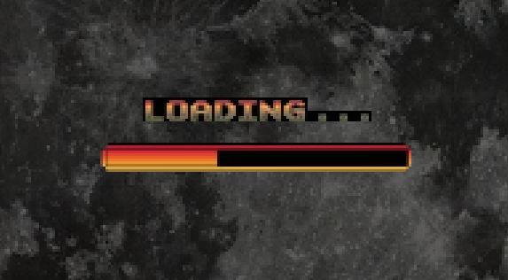

# MidnightDownloader
Download games at night without using extra electricity, for free!

Get the fully packaged executable from releases, or compile and modify it yourself!

# To run it:
-pip install -r requirements.txt  
-python md.py

# To use it:
Resize the green window using the bottom-right red button to fit your downloading bar perfectly, and move it precisely onto the downloading bar. Once that's done, click on "Start".

# How it works:
It takes a screenshot of the area every 5 minutes, then it measures the difference pixel-by-pixel from the taken and the original baseline screenshot. If at any point the difference is less than 2%, the program considers it complete and initiates the buffered shutdown (to avoid corrupting finishing file operations.)
# Now you can sleep peacefully ^^
### Created by: Milan Bartek
